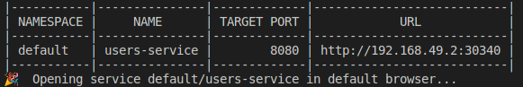
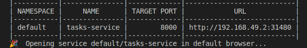
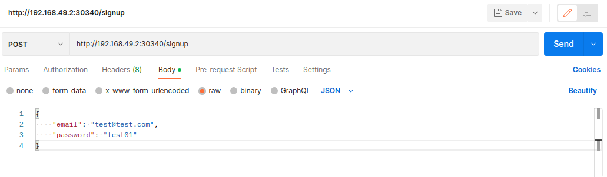
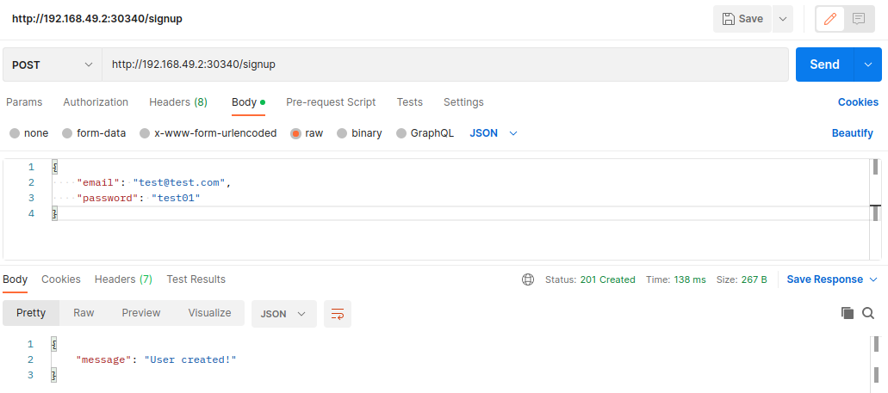
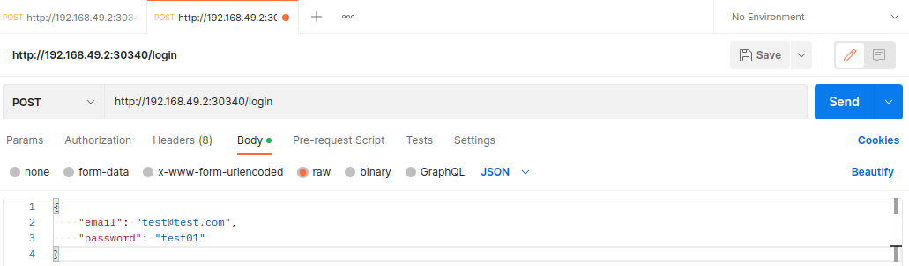
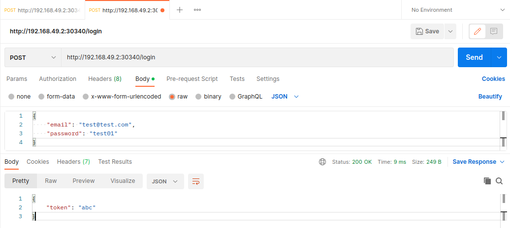
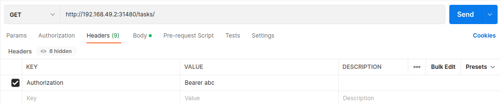
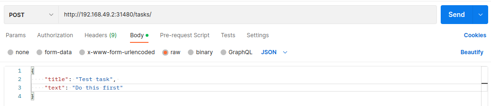
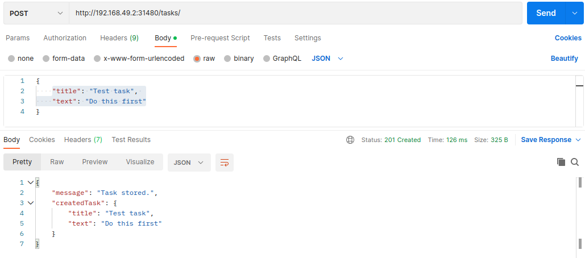

# Tasks with auth kubernetes demo

Demo application to manage tasks with users registration and a mock auth.

## Requirements
- Docker installed
- Kubernetes (kubectl) installed
- Minikube installed
- Postman

## Setup

1. Start a cluster with minikube
    ```console
    minikube start
    ```

2. Build the images
    ```console
    docker build -t kub-networking/auth-api auth-api/
    ```
    ```console
    docker build -t kub-networking/tasks-api tasks-api/
    ```
    ```console
    docker build -t kub-networking/users-api users-api/
    ```

3. Load images in minikube
     ```console
    minikube image load kub-networking/auth-api
    ```
     ```console
    minikube image load kub-networking/tasks-api
    ```
     ```console
    minikube image load kub-networking/users-api
    ```


## Run it

1. Apply the users api manifest files
    
    ```console
    kubectl apply -f kubernetes/tasks-pv.yaml -f kubernetes/tasks-pvc.yaml -f kubernetes/auth-deployment.yaml -f kubernetes/auth-service.yaml -f kubernetes/tasks-deployment.yaml -f kubernetes/tasks-service.yaml -f kubernetes/users-deployment.yaml -f kubernetes/users-service.yaml
    ```

2. Open a new terminal and expose the users service
    
    ```console
    minikube service users-service
    ```

    You will get an output like the following where you can get the `URL` of the service (`USERS_URL`)

    

    :warning: By default this command attempts to open the URL on your web browser, but you can close it.

3. Open a new terminal and expose the tasks service

    ```console
    minikube service tasks-service
    ```

    You will get an output like the following where you can get the `URL` of the service (`TASKS_URL`)

    

    :warning: By default this command attempts to open the URL on your web browser, but you can close it.

## Usage

Once you expose the users-service you should get the `URL` of the service and the following endpoints will be availables:

- ### Signup

    Create a new user

    - Endpoint: 
        ```http
        POST ${USERS_URL}/signup/
        ```

    - Request Params:

        | Parameter | Type     | Description               |
        | --------- | -------- | ------------------------- |
        | `email`   | `string` | **Required** User email   |
        | `password`| `string` | **Required** User password|

    - Body example:

        ```JSON
        {
            "email": "test@test.com",
            "password": "test01"
        }
        ```
        

    - Response:

        ```JSON
        {
            "message": "User created!"
        }
        ```
        

- ### Login
    Login using user credentials

    - Endpoint: 
        ```http
        POST ${USERS_URL}/login/
        ```

    - Request Params:

        | Parameter | Type     | Description               |
        | --------- | -------- | ------------------------- |
        | `email`   | `string` | **Required** User email   |
        | `password`| `string` | **Required** User password|

    - Body example:

        ```JSON
        {
            "email": "test@test.com",
            "password": "test01"
        }
        ```
        

    - Response:

        The API will send you the mocked token

        ```JSON
        {
            "token": "abc"
        }
        ```
        

- ### Add Task

    Create a task

    - Endpoint: 
        ```http
        POST ${TASKS_URL}/tasks/
        ```

    - Headers:

        | Key               | Value                |
        | ----------------- | -------------------- |
        | **Authorization** | Bearer ${USER_TOKEN} |

        

    - Request Params:

        | Parameter | Type     | Description                   |
        | --------- | -------- | -------------------------     |
        | `title`   | `string` | **Required** task title       |
        | `text`    | `string` | **Required** task description |

    - Body example:

        ```JSON
        {
            "title": "Test task", 
            "text": "Do this first"
        }
        ```
        

    - Response:

        ```JSON
        {
            "message": "Task stored.",
            "createdTask": {
                "title": "Test task",
                "text": "Do this first"
            }    
        }
        ```
        

- ### List Task
